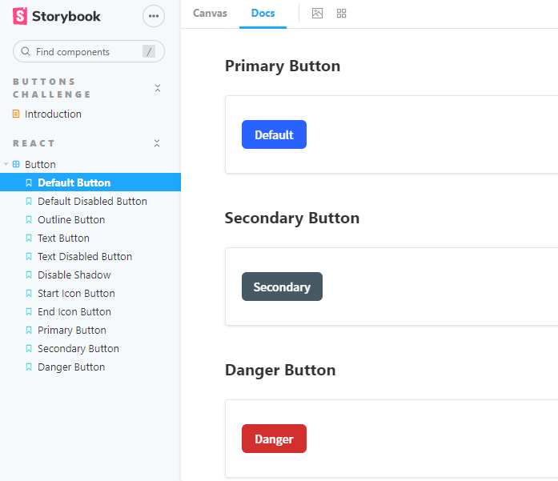

<!-- Please update value in the {}  -->

<h1 align="center">Button Component with React & Storybook</h1>

<div align="center">
   Solution for a challenge from  <a href="http://devchallenges.io" target="_blank">Devchallenges.io</a>.
</div>

<div align="center">
  <h3>
    <a href="https://storybook-button-component.cqrlosarch.vercel.app/?path=/story/buttons-challenge-introduction--page">
      Demo
    </a>
    <span> | </span>
    <a href="https://devchallenges.io/solutions/uaJbVYpN2dTeov9j9lsX">
      Solution
    </a>
    <span> | </span>
    <a href="https://devchallenges.io/challenges/ohgVTyJCbm5OZyTB2gNY">
      Challenge
    </a>
  </h3>
</div>

<!-- TABLE OF CONTENTS -->

## Table of Contents

- [Overview](#overview)
  - [Built With](#built-with)
- [Features](#features)
- [How to use](#how-to-use)
- [Contact](#contact)
- [Acknowledgements](#acknowledgements)

<!-- OVERVIEW -->

## Overview

<p align="center">
  
</p>


### Built With

<!-- This section should list any major frameworks that you built your project using. Here are a few examples.-->

- [Storybook](https://storybook.js.org/docs/react/get-started/introduction)
- [React](https://es.reactjs.org/)

## Features

<!-- List the features of your application or follow the template. Don't share the figma file here :) -->

This application/site was created as a submission to a [DevChallenges](https://devchallenges.io/challenges) challenge. The [challenge](https://devchallenges.io/challenges/ohgVTyJCbm5OZyTB2gNY) was to build an application to complete the given user stories.

## How To Use

<!-- This is an example, please update according to your application -->

To clone and run this application, you'll need [Git](https://git-scm.com) and [Node.js](https://nodejs.org/en/download/) (which comes with [npm](http://npmjs.com)) installed on your computer. From your command line:

```bash
# Clone this repository
$ git clone https://github.com/cqrlosArch/storybook-button-component

# Install dependencies
$ npm install

# Run the app
$ npm run storybook

# Build the app
$ npm run build-storybook
```

## Acknowledgements

<!-- This section should list any articles or add-ons/plugins that helps you to complete the project. This is optional but it will help you in the future. For exmpale -->

- [Steps to replicate a design with only HTML and CSS](https://devchallenges-blogs.web.app/how-to-replicate-design/)
- [Node.js](https://nodejs.org/)
- [Marked - a markdown parser](https://github.com/chjj/marked)

## Contact

- Discord [CqrlosArch#0296](https://discord.com/)
- Twitch [@cqrlosarch](https://www.twitch.tv/cqrlosarch/about)
- GitHub [@cqrlosArch](https://github.com/cqrlosArch)
- Twitter [@cqrlosArch](https://twitter.com/cqrlosArch)
- Youtube [Cqrlos Arch](https://www.youtube.com/channel/UCV8eaXiCFXUN5Rkpc42G3ZQ)